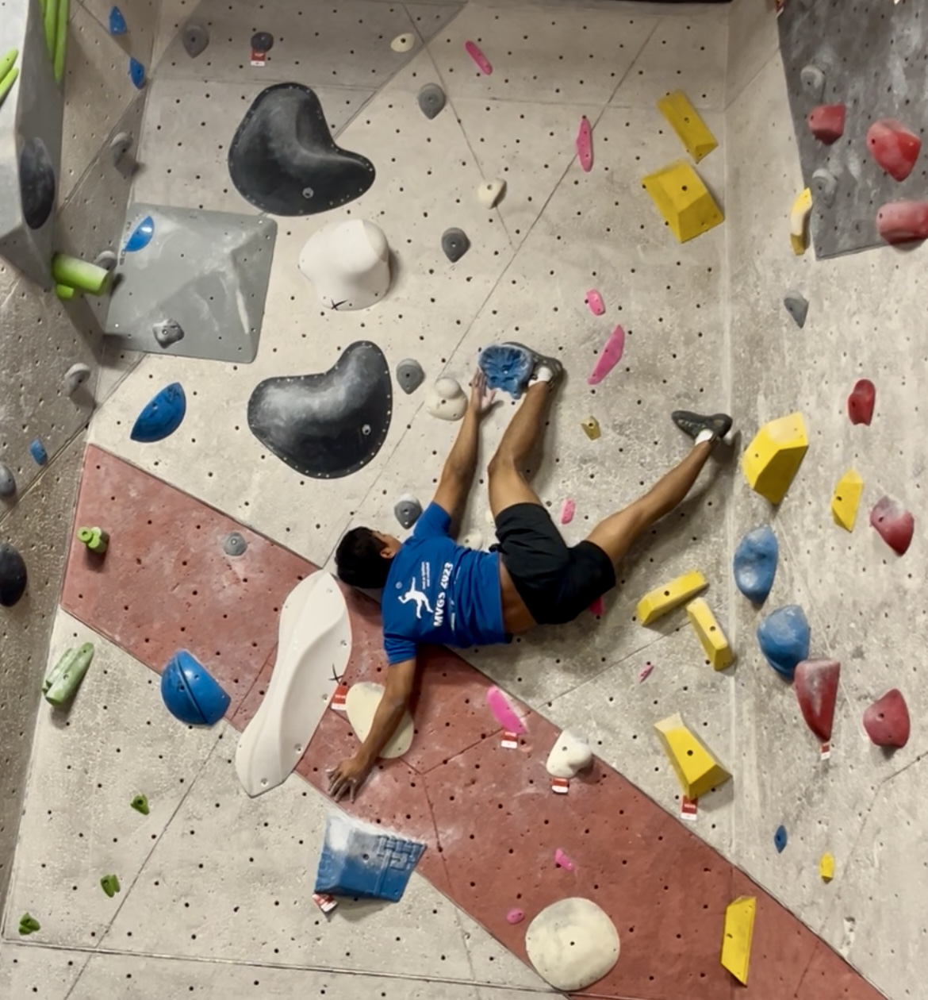

## Macalester College

At Macalester, I’m pursuing a double major in Economics and Statistics with a minor in French. I’ve served as a Preceptor for courses across the Mathematics, Statistics, and Economics departments:

| Semester        | Department   | Course                                        |
|:----------------|:-------------|:----------------------------------------------|
| **Fall 2026**   | Economics    | Intermediate Macroeconomics                   |
| **Spring 2026** | Econ / Stats | Econometrics, Machine Learning                |
| **Fall 2025**   | Econ / Stats | Intermediate Macroeconomics, Machine Learning |
| **Spring 2025** | Statistics   | Statistical Modelling                         |
| **Fall 2024**   | Mathematics  | Applied Multivariable Calculus II             |

As you might guess, I love teaching!

## Programs

I have participated in research and training programs such as the [Expanding Diversity in Economics](https://www.macalester.edu/news/2024/04/three-macalester-students-selected-for-university-of-chicagos-prestigious-economics-program/) (EDE) Program at the University of Chicago (Summer of 2024), the [Mathematical Modeling and Public Health Workshop](https://hsph.harvard.edu/epidemiology/news/mathematical-modeling-and-public-health-workshop/) at Harvard Chan School (March 2025), and [SUMMIT\@BOOTH](https://www.chicagobooth.edu/phd/admissions/events/summit-booth/summit-2025-cohort) hosted by Chicago Booth at the University of Chicago (November 2025).

### Hobbies

|  |  |
|----|----|
| {width="20cm"} | Outside the classroom, I like being active and exploring nature. I've been climbing for around 2 years! Climbing challenges me to stay focused and push my limits, both mentally and physically. I also enjoy running, apnea diving, and trying out new restaurants. |

## United World Colleges

I attended the [UWC Red Cross Nordic](https://www.uwc.org/rcn) (UWCRCN), located in Flekke, Norway. UWC makes education a force to unite people, nations and cultures for peace and a sustainable future.

While in Norway, I pursued the International Baccalaureate (IB) and had the honor of representing the UWC movement and my school at [the Nobel Peace Prize Ceremony in December 2022](https://uwcrcn.no/nobel-peace-prize_2022/). Beyond academics, I spent my time hiking, diving, and growing—personally and intellectually.
