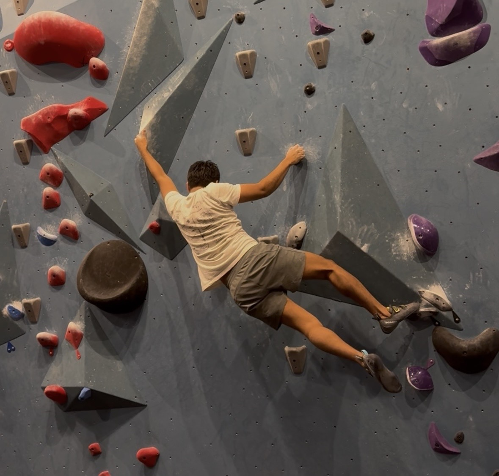
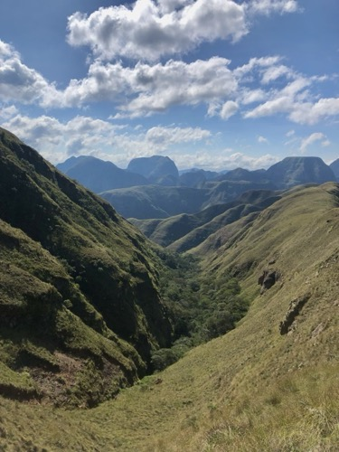
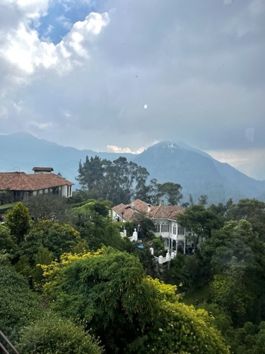
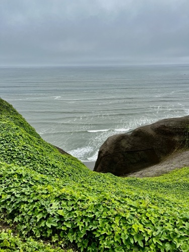
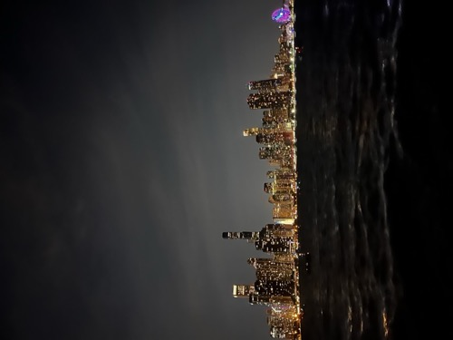
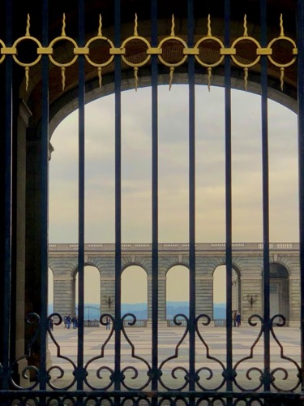
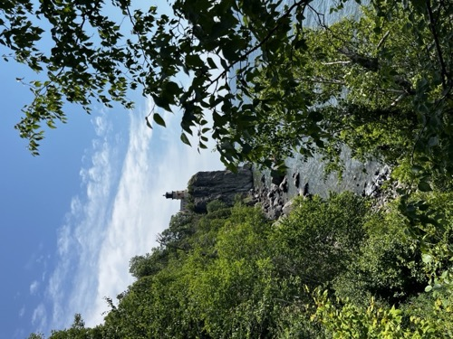

```{=html}
<style>
.photo-grid { display:grid; grid-template-columns:repeat(3,1fr); gap:6px; }
.photo-grid .tile { position:relative; overflow:hidden; height:220px; }
.photo-grid .tile img { display:block; width:100%; height:100%; object-fit:cover; filter:grayscale(100%); transition:filter 0.3s; }
.photo-grid .tile .caption { position:absolute; inset:0; background:rgba(40,40,40,0.6); color:#fff; display:flex; align-items:center; justify-content:center; text-align:center; padding:0 12px; opacity:1; transition:opacity 0.3s; }
.photo-grid .tile:hover img { filter:none; }
.photo-grid .tile:hover .caption { opacity:0; }
</style>

<div class="photo-grid">
  <div class="tile">
    
    <div class="caption">V5–V6 Route at the St. Paul Bouldering Project</div>
  </div>
  <div class="tile">
    
    <div class="caption">Codo de los Andes in Santa Cruz, Bolivia</div>
  </div>
  <div class="tile">
    
    <div class="caption">Monserrate in Bogotá, Colombia</div>
  </div>
  <div class="tile">
    
    <div class="caption">Miraflores in Lima, Perú</div>
  </div>
  <div class="tile">
    
    <div class="caption">Chicago Skyline from Lake Michigan</div>
  </div>
  <div class="tile">
    
    <div class="caption">Palacio Real in Madrid, Spain</div>
  </div>
  <div class="tile">
    
    <div class="caption">Aurora Borealis over Flekke, Norway</div>
  </div>
  <div class="tile">
    
    <div class="caption">Split Rock Lighthouse near Duluth, MN</div>
  </div>
  <div class="tile">
    
    <div class="caption">Old Main at Macalester College</div>
  </div>
</div>
```
