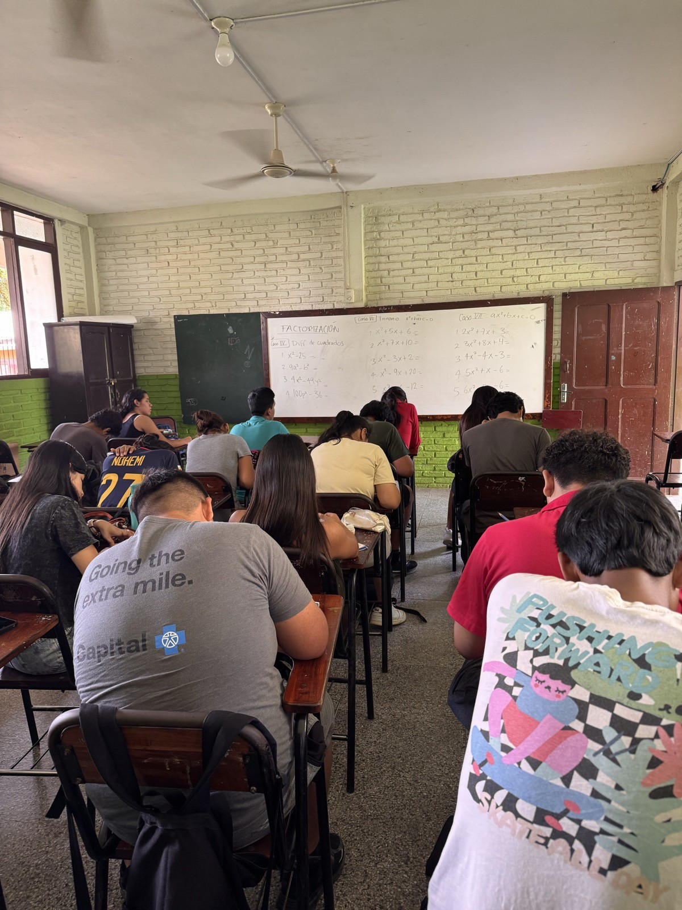
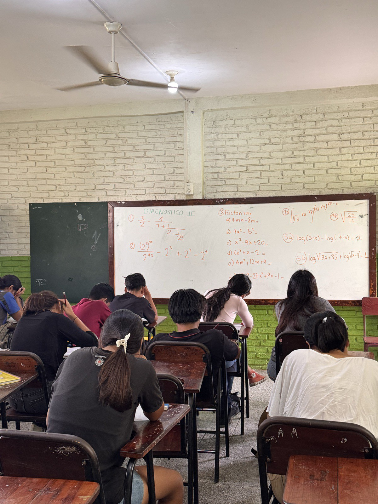
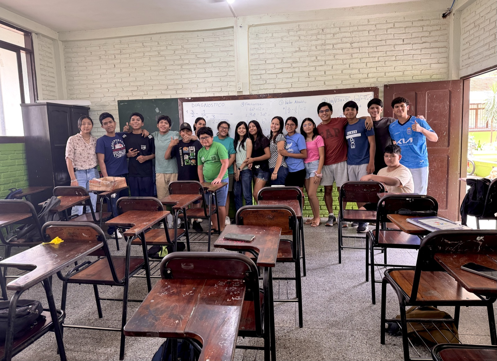

## Why I Started This

*Camino a la U* came from my own experience navigating scholarships and applications with very little guidance. I wanted to make the path clearer for students who were just as capable as I was, but who lacked the information, mentorship, and financial resources.

## The Problem

To enter a public university in Bolivia, students must pass a single high-stakes entrance exam. There is no holistic review. [Every year, 25,000–27,000 students in Santa Cruz take the PSA/CUP admission exam](https://eju.tv/2023/01/mas-de-13-mil-estudiantes-daran-el-examen-del-cup-de-la-uagrm/), competing for only about 100 spots per major.

The students who pass are rarely just the most capable. They are the ones who can afford preparation courses that bridge the gap between what public schools teach and what the exam demands. A prep course costs around 700 bolivianos (100 USD), roughly 22% of a family's monthly income. Access to college becomes access to test prep.

## What We Did

In December 2025 and January 2026, I went back home to Santa Cruz to run the program's first cohort, backed by a \$2,000 [Live It Fund grant](https://www.macalester.edu/entrepreneurship-and-innovation/turning-vision-into-action-live-it-fund-j-term-2026-projects/) from Macalester's Entrepreneurship and Innovation Department:

- **Selected 25 students** from a pool of more than 200 applicants.
- **Coordinated five teachers** from my old school, Hnos. Cavanis, and secured approval from the school's principal and the state department of education.
- **Built the curriculum around real exam-style questions**, which I had been collecting and studying since November.
- **Covered every barrier the grant could reach:** school materials, refreshments, and transportation for students who needed it.

## The Results

Students took two quizzes every week, plus three cumulative exams covering all the material:

|                   | Pre-Test | Mid-Term | Final Test |
|-------------------|:--------:|:--------:|:----------:|
| **Average score** |  32.3%   |  42.3%   |   84.2%    |

By the end of the program, the cohort's average score had climbed 52 percentage points — from 32% on the diagnostic to 84% on the final — on the kind of exam where a few points decide who gets a seat.

## In the Classroom

```{=html}
<style>
#caminoCarousel .carousel-item img {
  width: 100%;
  height: 520px;
  object-fit: contain;
  background: #1a1a1a;
  border-radius: 8px;
}
#caminoCarousel .carousel-caption {
  background: rgba(0, 0, 0, 0.55);
  border-radius: 6px;
  padding: 0.4rem 1rem;
}
#caminoCarousel .carousel-caption p {
  margin: 0;
}
</style>

<div id="caminoCarousel" class="carousel slide mb-4">
  <div class="carousel-inner">
    <div class="carousel-item active">
      
      <div class="carousel-caption">
        <p>Factorization day: working through exam-style drills.<br><small>Photo shared with the students' consent.</small></p>
      </div>
    </div>
    <div class="carousel-item">
      
      <div class="carousel-caption">
        <p>A student takes on a diagnostic problem at the board.<br><small>Photo shared with the students' consent.</small></p>
      </div>
    </div>
    <div class="carousel-item">
      
      <div class="carousel-caption">
        <p>The first <em>Camino a la U</em> cohort at Hnos. Cavanis.<br><small>Photo shared with the students' consent.</small></p>
      </div>
    </div>
  </div>
  <button class="carousel-control-prev" type="button" data-bs-target="#caminoCarousel" data-bs-slide="prev">
    <span class="carousel-control-prev-icon" aria-hidden="true"></span>
    <span class="visually-hidden">Previous</span>
  </button>
  <button class="carousel-control-next" type="button" data-bs-target="#caminoCarousel" data-bs-slide="next">
    <span class="carousel-control-next-icon" aria-hidden="true"></span>
    <span class="visually-hidden">Next</span>
  </button>
</div>
```

## Free Prep for Everyone

To make the project sustainable beyond the cohort, I recorded the questions students missed most often, and the mistakes behind them, and published everything as a free [YouTube playlist](https://www.youtube.com/playlist?list=PLgfKfyY-9T3lcABrk12_IFZiXOIIoEvtB). I plan to keep adding videos so that any student, anywhere, can practice and improve their chances of getting in.

```{=html}
<div class="ratio ratio-16x9 mb-4" style="border-radius: 8px; overflow: hidden;">
  <iframe src="https://www.youtube.com/embed/videoseries?list=PLgfKfyY-9T3lcABrk12_IFZiXOIIoEvtB" title="Camino a la U — free exam prep playlist" allow="accelerometer; autoplay; clipboard-write; encrypted-media; gyroscope; picture-in-picture" allowfullscreen></iframe>
</div>
```

## The Long Game

The long-term goal is not to grant access to the 25 students in my cohort, or to whoever finds my videos. It is to remove the barrier itself, so that no one has to decide who gets to pursue higher education, and financing is never the limitation.

> Education was my path to freedom, and I want others to find theirs.
