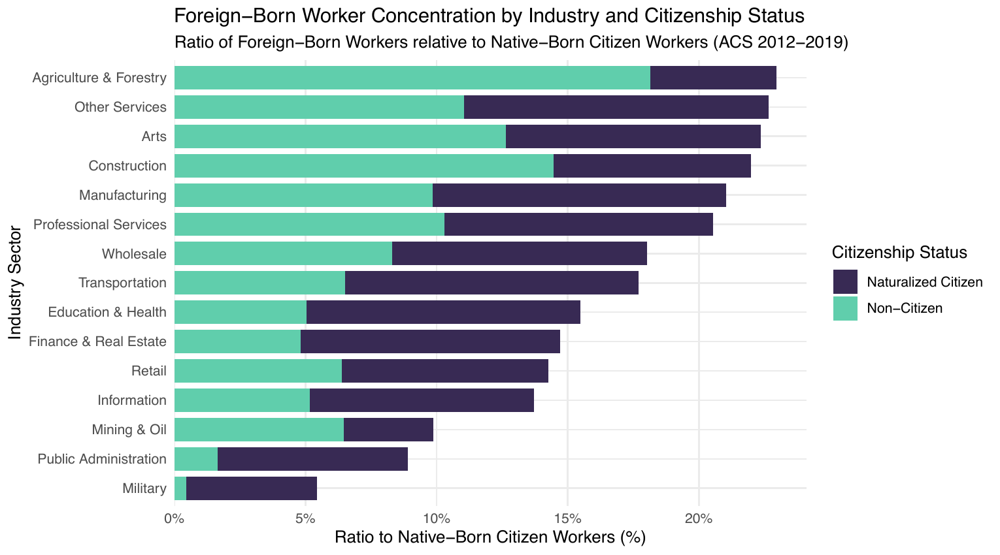
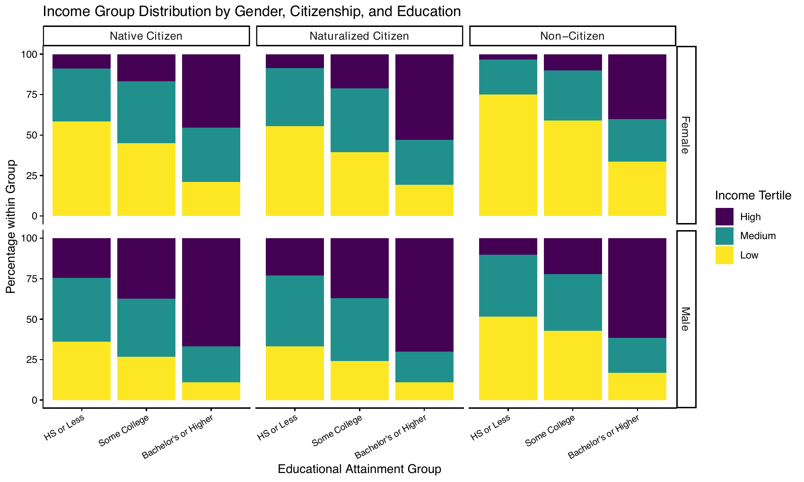

This is an executive summary of my research. The full paper is available [here](Rios_Wage_Disparities_Paper.pdf), along with the [conference poster I made](Rios_Wage_Disparities_Poster.pdf) when I presented at the 2026 PREDOC Conference at UChicago Booth.

## Description

In my Econometrics class, I researched wage disparities by gender and citizenship status in the U.S. labor market. My central question: **how do citizenship status and sex *jointly* shape wage disparities in the U.S. labor market?**

The study uses pooled American Community Survey (ACS) data from 2012–2019. The final sample contains **526,832 workers across 118 PUMA–state geographies**, with wages expressed in constant 2015 dollars. Citizenship is disaggregated into three groups: native-born citizens (85.2% of the sample), naturalized citizens (8.3%), and non-citizens (6.6%).

Three strands of literature try to explain immigrant–native wage gaps: **human capital**, where gaps are attributed to English proficiency, education, and the systematic devaluation of foreign credentials [@chiswick1978; @borjas1994; @blau_kahn2015]; **occupational segregation**, where immigrants cluster in low-wage, labor-intensive industries [@borjas2018; @garg2004]; and **discrimination**, where employer bias and colorism depress wages beyond any productivity difference [@hersch2011; @oreopoulos2011]. These literatures treat immigrants as a uniform group. Almost none examine how citizenship and gender *interact,* the "double jeopardy" that intersectionality theory predicts [@browne_misra2003]; which is precisely the gap this paper fills.

> **Fig. 1:** Ratio of Foreign-Born to Citizen Workers by Industry. Both naturalized and non-citizen workers are disproportionately represented in labor-intensive, lower-wage industries.
>
> **Source:** own calculations using the ACS Data.

> **Fig. 2:** Income Group Distribution by Gender, Citizenship, and Education. Even among workers holding a bachelor's degree or higher, non-citizen women remain concentrated in the low-income bracket, while native-born men show the most favorable distribution.
>
> **Source:** own calculations using the ACS Data.

## Empirical Strategy

I use two complementary approaches: a modified Mincer earnings regression to estimate conditional wage differentials, and a Blinder–Oaxaca decomposition to attribute the raw gaps to characteristics versus returns.

$$
\begin{aligned}
\ln(wage_{i,s,t}) = \;& \beta_0 + \beta_1\, Nat_{i,s,t} + \beta_2\, NonCit_{i,s,t} + \beta_3\, Female_{i,s,t} \\[4pt]
&+ \beta_4\,(Nat \times Female)_{i,s,t} + \beta_5\,(NonCit \times Female)_{i,s,t} \\[4pt]
&+ \mathbf{Z}'_{i,s,t}\,\boldsymbol{\gamma}
+ \alpha_s + \tau_t + \theta_{j(i)} + \psi_{b(i)} + \varepsilon_{i,s,t}
\end{aligned}
$$

where $\mathbf{Z}$ is a vector of controls (education group, centered age and its square, English proficiency, number of resident children, and race), and $\alpha_s, \tau_t, \theta_{j}, \psi_{b}$ are fixed effects for PUMA–state geography, year, industry, and birthplace region. Native-born citizens and men are the reference groups, and standard errors are clustered on the 118 PUMA–state geographies.

The coefficient of interest is $\beta_5$: the **additional** wage gap faced by non-citizen women, over and above the separate gender and citizenship terms.

I then apply a two-fold Blinder–Oaxaca decomposition with pooled reference coefficients to four contrasts. This splits each raw gap into an **explained** component (differences in observable characteristics, valued at pooled returns) and an **unexplained** component (differences in the *returns* to those characteristics). The unexplained share is commonly read as a proxy for discrimination, though it also absorbs unobserved productivity differences — so I treat it as an upper bound rather than a point estimate.

## Results

### Mincer regression

| Variable | Model 1 | Model 2 | Model 3 |
|:---|:---:|:---:|:---:|
| Naturalized Citizen | 0.148\*\*\* | 0.042\*\*\* | 0.045\*\* |
| Non-Citizen | −0.247\*\*\* | −0.018 | −0.020 |
| Female | −0.403\*\*\* | −0.437\*\*\* | −0.359\*\*\* |
| Naturalized × Female | 0.019 | 0.043\*\* | 0.023 |
| **Non-Citizen × Female** | **−0.040\*\*** | **−0.042\*\*\*** | **−0.048\*\*\*** |
| Controls | | X | X |
| Fixed Effects | | | X |
| $R^2$ | 0.038 | 0.339 | 0.390 |

: **Table 1:** Effect of Gender and Citizenship on Log Wages. N = 526,832. \*\*\* p<0.01, \*\* p<0.05. Model 1 has no controls; Model 2 adds human capital and demographic controls; Model 3 adds year, industry, birthplace, and geography fixed effects.

- **Women earn approximately 30% less than men** in the preferred specification (Model 3), conditional on human capital, race, industry, and location. Notably, the gender penalty *widens* once controls are added. Women in the sample hold slightly better observable characteristics than men, so comparing equally credentialed workers enlarges the gap.

- **Non-citizen women face an additional 4.7% penalty** beyond the effects of gender and citizenship alone (p<0.01).

- **Naturalized citizens earn about 4.6% more** than native-born citizens, consistent with legal status mitigating. The raw 22% non-citizen penalty, by contrast, **disappears** once human capital and race controls are introduced, suggesting citizenship gaps operate mainly through human capital rather than unequal pay.

- Racial stratification operates alongside, not instead of, citizenship and gender: conditional on everything else, Black workers earn 18.2% less than observationally similar White workers, American Indian/Alaska Native workers 9.5% less, Hispanic/Latino workers 6.7% less, and Asian/Pacific Islander workers 4.9% less.

### Blinder–Oaxaca decomposition

| Contrast | Total Gap | Explained | Unexplained | % Unexplained |
|:---|:---:|:---:|:---:|:---:|
| Male vs. Female | 0.397\*\*\* | 0.031\*\*\* | 0.366\*\*\* | 92.1 |
| Citizen vs. Non-Citizen | 0.243\*\*\* | 0.208\*\*\* | 0.035\*\* | 14.3 |
| NC Female vs. Citizen Female | −0.302\*\*\* | −0.219\*\*\* | −0.084\*\*\* | 27.7 |
| NC Female vs. NC Male | −0.443\*\*\* | −0.025\*\* | −0.417\*\*\* | 94.3 |

: **Table 2:** Two-fold Blinder–Oaxaca decompositions, pooled reference. Gaps are in log points; "NC" denotes non-citizen. \*\*\* p<0.01, \*\* p<0.05.

The main finding is that **the gender and citizenship gaps have opposite anatomies**:

- The **gender gap is 92.1% unexplained.** The explained component is small (0.031) only because two forces offset: women's industry composition works against them, while their *advantage* in educational attainment pushes the other way. Within the unexplained portion, the largest identifiable contributor is the return to children: a fatherhood premium coexisting with a motherhood penalty.

- The **citizenship gap is 85.7% explained**, mostly driven by English proficiency and educational attainment.

- Relative to citizen women, non-citizen women earn about 26% less, roughly 72% of which reflects lower English proficiency and education, but a significant 27.7% reflects **lower returns** to the characteristics they do hold, direct evidence of credential devaluation. Most strikingly, relative to non-citizen men, non-citizen women earn about **36% less and 94.3% of it is unexplained**, even though their observable characteristics are, on net, nearly identical.

## Takeaways

Citizenship gaps are largely **structural**, rooted in human capital; gender gaps are largely **unexplained**, consistent with employer bias and statistical discrimination. Where the two intersect, non-citizen women face a compounded penalty that survives every control I can throw at it.

The policy implication is that improving access to human capital, while necessary, is not sufficient. Structural reforms must also dismantle the biases embedded in labor market institutions.

A caveat: because the data are pooled cross-sections, these estimates should be read as conditional associations rather than causal effects, and the "unexplained" component is an upper bound on discrimination rather than a direct measure of it.

## Selected References
::: {#refs}
:::
