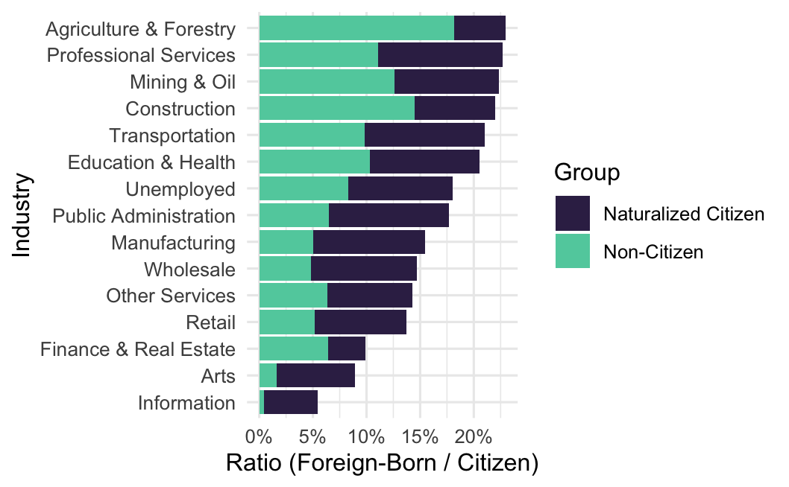

## Description

In my Econometrics class, I researched wage disparities based on gender and citizenship status in the U.S. under the supervision of Prof. Amy Damon.

This study used the ACS Data from 2012-2019. My research focused on foreign-born workers in the agriculture, construction, and service sectors—industries where immigrant labor is most concentrated as seen in the figure below.

> **Fig. 1:** Ratio of Foreign-Born to Citizen Workers by Industry.
>
> **Source:** own calculations using the ACS Data.

## Empirical Strategy

I utilized a Mincer earnings regression (see equation below) and Blinder-Oaxaca decomposition to estimate wage differentials while controlling for human capital characteristics, sociodemographic factors, and industry and geographic fixed effects.

$$
\begin{align}
 \ln(wage_{i,s,t}) = \;& \hat{\beta}_0 + \hat{\beta}_1\, Citizen_{i,s,t}
    + \hat{\beta}_2\, Sex_{i,s,t}
    + \hat{\beta}_3\,(Citizen \times Sex)_{i,s,t}
    + \mathbf{X}'_{i,s,t}\,\hat{\beta}_4 \\[4pt]
    &+ \sum_{s=1}^{S} \hat{\gamma}_s\, D_{s,i}
    + \sum_{t=1}^{T} \hat{\tau}_t\, D_{t,i}
    + \sum_{j=1}^{J} \hat{\theta}_j\, D_{j,i}
    + \sum_{k=1}^{K} \hat{\delta}_k\, D_{k,i}
    + \epsilon_{i,s,t}
\end{align}
$$

where $\mathbf{X}'_{i,s,t}$ includes education, experience, and English proficiency, and fixed effects control for geography, year, industry, and birthplace.

## Results?

-   Females earn approximately 32.7% less than males, primarily due to intangible factors such as employer bias and statistical discrimination.

-   The analysis further reveals that non-citizen women face an additional 7.9% wage penalty beyond the independent effects of gender and citizenship alone.

-   Additionally, Naturalized citizens earn about 3.7% more than native-born citizens, likely due to positive selection and legal protections.

## Publication & Access

This paper is published in the *Macalester Street Journal*:\
**Equilibrium, Vol. 3 No. 1 (2025)**

📖 **Read it on:**

-   <a href="https://scholar.google.com/scholar?q=10.62543/msj.v3i1.90" target="_blank" title="View on Google Scholar" style="display: inline-flex; align-items: center; text-decoration: none; margin-right: 15px;">  [Google Scholar]{style="font-size: 1em;"} </a>

-   <a href="https://macalesterstreet.org/index.php/journal/article/view/90" target="_blank" title= "View on MSJ website" style="display: inline-flex; align-items: center; text-decoration: none; margin-right: 15px;">  [MSJ Website]{style="font-size: 1em;"} </a>
